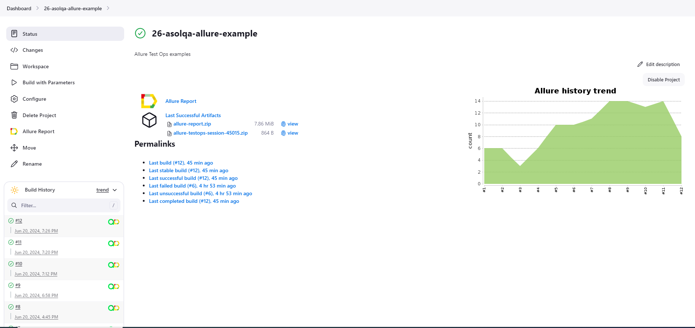
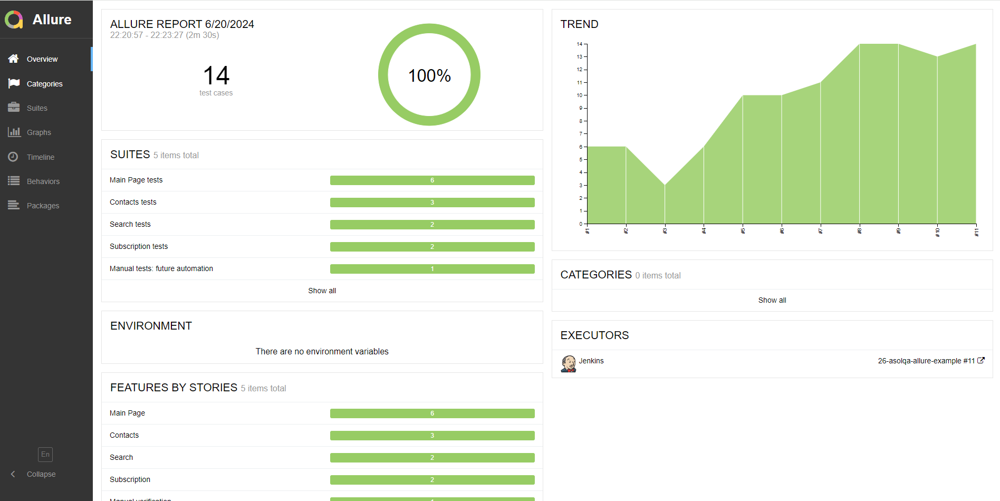
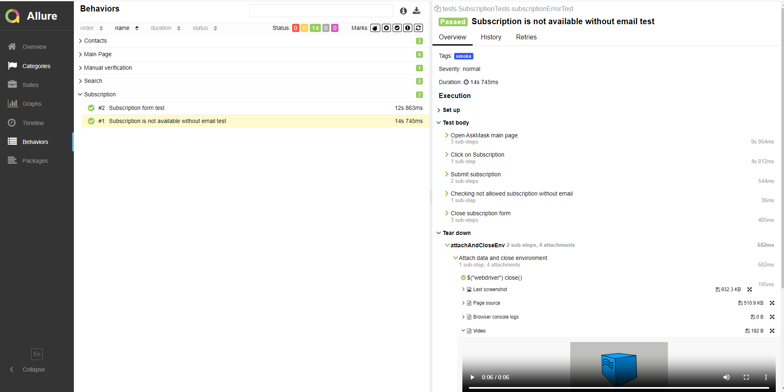
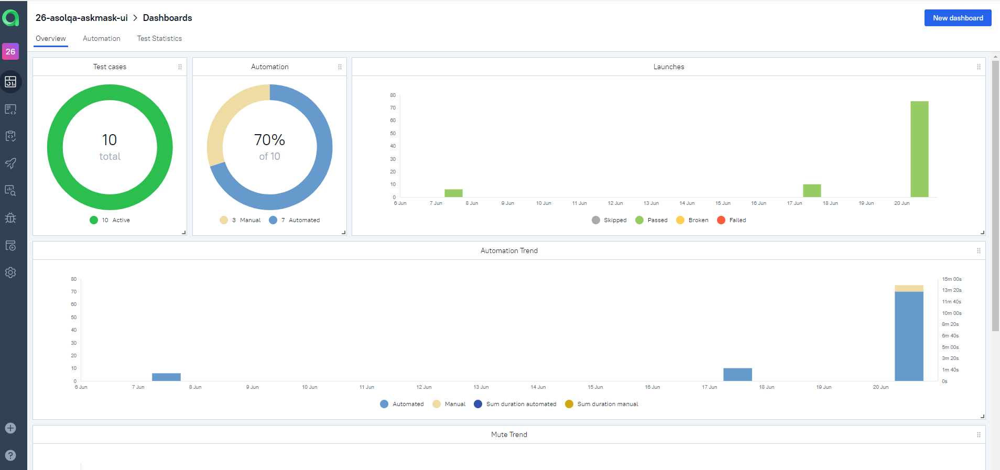
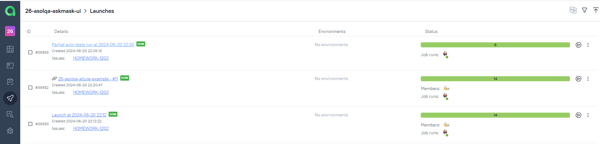
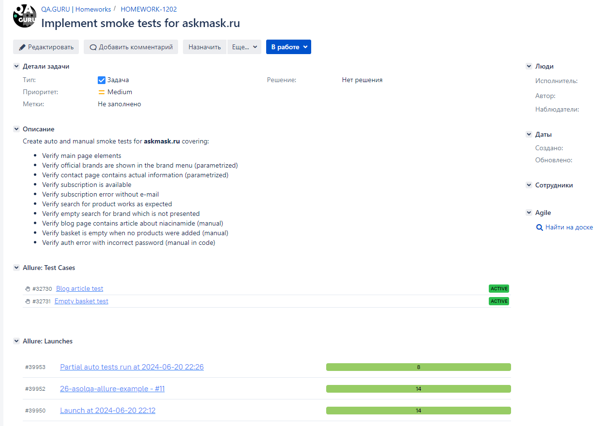
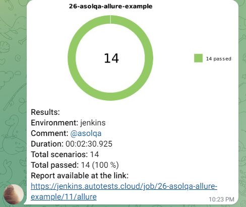

# Web UI test automation project for [AskMask.ru](http://askmask.ru)

---

AskMask is a large online store for Asian cosmetics and official distributor for top Korean and Japanese 
brands in Russia

<a href="http://askmask.ru"></a>

---


## Content:

- <a href="#facts">About the project</a>
- <a href="#tools">Tools and technologies</a>
- <a href="#scenarios">Test scenarios</a>
- <a href="#cli">Launch from the CLI</a>
- <a href="#jenkins">CI/CD with Jenkins</a>
- <a href="#allure">Allure reporting</a>
- <a href="#allure-testops">Integration with Allure TestOps</a>
- <a href="#jira">Integration with JIRA</a>
- <a href="#telegram">Bot notifications in Telegram</a>
- <a href="#video">Examples of test execution</a>


<a id="facts"></a>
## About the project
* `Page Object` pattern
* Config with `Owner` library
* Tests parametrization
* `Allure` reporting with logged tests information
* Manual tests in code for future automation
* Launch all or separate tests from `Allure TestOps` directly
* `JIRA` integration
* Telegram notifications


<a id="tools"></a>
## Tools and technologies:
<p align="center">
<a href="https://www.jetbrains.com/idea/"></a>  
<a href="https://www.java.com/"></a>  
<a href="https://github.com/"></a>  
<a href="https://junit.org/junit5/"></a>  
<a href="https://gradle.org/"></a>  
<a href="https://selenide.org/"></a>  
<a href="https://aerokube.com/selenoid/"></a>  
<a href="https://github.com/allure-framework/allure2"></a>
<a href="https://qameta.io/"></a>   
<a href="https://www.jenkins.io/"></a>  
<a href="https://www.atlassian.com/ru/software/jira/"></a>
</p>

<a id="scenarios"></a>
## Test Scenarios
* [x] Verify main page elements
* [x] Verify official brands are shown in the brand menu (parametrized)
* [x] Verify contact page contains actual information
* [x] Verify subscription is available
* [x] Verify subscription error without e-mail
* [x] Verify search for product works as expected
* [x] Verify empty search for brand which is not presented 
* [x] Verify blog page contains article about niacinamide
* [x] Verify basket is empty when no products were added (manual)
* [x] Verify auth error with incorrect password (manual in code)


<a id="cli"></a>
##  Launch from the CLI

**Local launch:**
```bash  
./gradlew clean askmask_smoke_test Denv=local
```

**Remote launch:**
```bash  
./gradlew clean askmask_smoke_test Denv=remote
```

All browser configurations are described in the `common-config.propeties`, `local.properties` and `remote.properties` files.
If needed configurations could be changed in those files.

Properties file config explanation:
- `browser` (browser for UI tests, chrome is supported)
- `browser.version` (version of browser for UI tests)
- `browser.size` (size of browser for UI tests)
- `base.url` (URL for UI tests)
- `page.load.strategy` (how web driver handles the loading of new page, by default is `eager`)
- `remote.url` (URL for remote WebDriver)
- `remote.mode.enabled` (defines local or remote environments)

<a id="jenkins"></a>
## </a><a name="CI/CD with Jenkins"></a>CI/CD with [Jenkins](https://jenkins.autotests.cloud/job/26-asolqa-training_project/)</a>
 

### Jenkins job parameters:

- `COMMENT` (by default @asolqa is tagged)

After the build is done the test results are available in `Allure`, `Allure TestOps` and `JIRA`

<a id="allure"></a>
## </a> <a name="Allure"></a>Allure [reporting](https://jenkins.autotests.cloud/job/26-asolqa-training_project/allure/)</a>
 

`Allure` report includes:
- Test steps
- Screenshot of the page at the last step
- Page Source
- Browser console logs
- Video of execution for automated tests



<a id="allure-testops"></a>
## </a> Integration with <a target="_blank" href="https://allure.autotests.cloud/project/4206/dashboards">Allure TestOps</a>

`Allure TestOps` processes tests as a documentation and synchronizes automated and manual verifications. 
Here all test cases execution results are available. 

Dashboard contains test runs statistics:


Automated cases:


Manual cases:


Manual cases added from the code for future automation:
TBD

Launches:



<a id="jira"></a>
## </a> Integration with <a target="_blank" href="https://jira.autotests.cloud/browse/HOMEWORK-1202">Jira</a>

`Jira` task has information about all created test cases, their statuses and test launches results from `Allure TestOps`:



<a id="telegram"></a>
## </a> Bot notifications in Telegram
After every build Telegram bot sends notification with `Allure` report:
 

<a id="video"></a>
## </a> Examples of test execution
 


